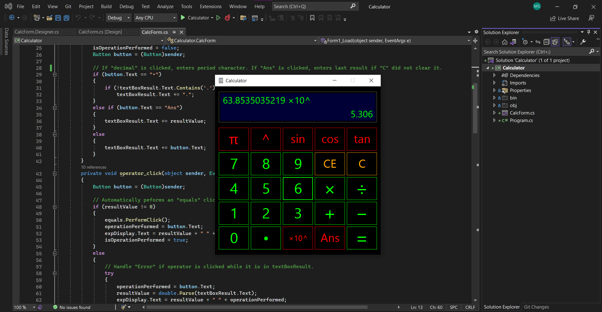

# Calculator
This project is not as advanced as [LimeDrive.net](https://github.com/Mohammad-SU/LimeDrive-Cloud-Storage-Public), my cloud storage service, so please do take a look at that if you haven't already!

## Program in action: https://youtu.be/odKDBLcFtEo

C# (.NET) – Desktop calculator developed with WinForms. Includes scientific functions.

For some of the main code that I wrote:
https://github.com/Mohammad-SU/Calculator-CSharp/blob/main/Calculator/Calculator/CalcForm.cs

### Future update ideas:
- More functions/operations
- Brackets
- A display of the complete expression on the top left of the calculator's display
- Order of operations, after implementing the above feature
